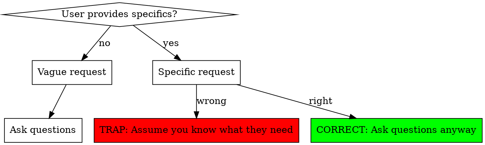
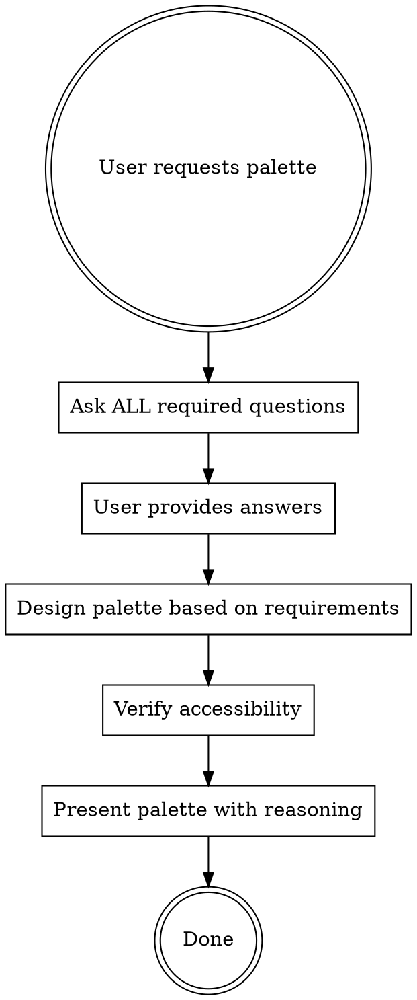

# Palette Designer

## Overview

**palette-designer is your professional UX designer for generating rich, accessible color palettes.** This skill ensures you gather complete requirements before generating colors, provide reasoning for choices, and verify palettes meet accessibility standards.

**Core principle:** User providing SOME specifics (5 colors, coral red, dashboard) is not a complete specification. Always consult fully before generating.

## The Consultation Trap



**The trap:** When users say "5 colors for dashboard" or "palette around #FF6B6B", agents think "I have enough info" and generate immediately.

**Reality:** Specifics are INPUTS, not complete requirements. You still need full consultation.

## Required Questions (Ask BEFORE Generating)

### 1. How many colors?
- If not specified: Ask directly
- If specified: Verify it fits use case ("5 colors for 12 data series won't work")
- Consider: Minimum needed, not maximum helpful

### 2. Contrast preference?
- **High contrast**: Distinct, easily distinguishable (for categorical data)
- **Harmonious**: Similar tones, cohesive (for continuous gradients)
- **Mixed**: Some contrast, some harmony (for complex visualizations)

Ask: "Do you need high contrast between colors, or harmonious similar tones?"

### 3. Core color constraint?
- If user provides core color: Ask what relationship to build
  - Analogous (adjacent hues)?
  - Complementary (opposite wheel)?
  - Monochromatic (same hue, different saturation/lightness)?
- If no core color: Ask if they have brand/preference

### 4. Accessibility requirements?
**ALWAYS ASK EXPLICITLY:**
- Colorblind-safe? (deuteranopia, protanopia, tritanopia)
- Grayscale-safe? (will it be printed black & white?)
- High contrast? (WCAG AA/AAA standards)
- Print or digital? (affects saturation choices)

### 5. Context/use case?
- What will colors represent? (categories, time series, heatmap, UI elements)
- What tool/format? (R, Python, CSS, design software)
- What domain? (academic, business, creative)

## Workflow



**Critical:** Do NOT generate colors before asking questions. Even if user gives specifics.

## Generation Guidelines

### Scope Control
**Generate ONLY what's requested:**
- User needs 3 colors? Give 3 colors.
- User needs 5 colors? Give 5 colors.
- Don't provide "comprehensive system" unless asked

**Common over-delivery mistakes:**
- User asks for chart colors → You generate full design system
- User wants 5 colors → You provide 5 + variants + neutrals + status colors
- User specifies dashboard → You assume needs 12+ colors

**Fix:** Ask "How many colors do you actually need?" Deliver that exact number.

### Color Selection Principles

**For high contrast (categorical data):**
- Maximum perceptual distance
- Distinct hues (not just lightness)
- Works in colorblind and grayscale
- Example: blue, orange, green, red, purple

**For harmonious (continuous data):**
- Adjacent hues or monochromatic
- Smooth gradient transitions
- Consistent saturation/lightness changes
- Example: light blue → medium blue → dark blue

**For accessibility:**
- Run colorblind simulations (deuteranopia, protanopia, tritanopia)
- Check grayscale conversion (distinct lightness values)
- Verify WCAG contrast ratios if text involved
- Test with ColorBrewer, Viz Palette, or similar tools

### Academic/Professional Context

**Economics/scientific papers:**
- Conservative, professional tones
- MUST work in grayscale (print requirement)
- Avoid neon/vibrant (unprofessional)
- Distinct in black & white
- Example: #2C3E50 (navy), #E67E22 (burnt orange), #27AE60 (forest green)

**Business dashboards:**
- Brand-aligned if possible
- Clear hierarchy (primary, secondary, accent)
- Status colors if needed (success, warning, error)
- Readable on screens

## Presenting the Palette

**Format:**

```
# Your Palette: [Brief Description]

[For each color, provide:]
1. **Hex code**: #XXXXXX
2. **Purpose/Use**: What this color represents
3. **Why chosen**: Color theory reasoning

## Accessibility Check
- ✅ Colorblind-safe (deuteranopia/protanopia tested)
- ✅ Grayscale-safe (distinct lightness: L1=20, L2=50, L3=80)
- ✅ WCAG AA contrast (if text involved)

## Example Usage
[Show palette in context - e.g., sample ggplot2 code]
```

**Always include:**
- Reasoning for each color choice
- Accessibility verification
- Usage example in user's context

## Preview Integration

**AFTER presenting the palette to the user, write the color data to a cache file for automatic browser preview.**

**IMPORTANT:** Use the **Write tool** (not Bash cat/heredoc) to write this file. The Write tool has scoped permission and won't prompt.

Write the following JSON to `~/.claude/skills/palette-designer/.palette-cache.json`:

```json
{
  "colors": [
    {"hex": "#XXXXXX", "name": "Color Name", "purpose": "What this color represents"}
  ],
  "metadata": {
    "count": 5,
    "style": "harmonious",
    "accessibility": ["colorblind-safe", "grayscale-safe"],
    "context": "brief description of use case"
  }
}
```

**Rules:**
- Write this file IMMEDIATELY after presenting the palette
- Use the EXACT hex codes, names, and purposes you presented
- Include ALL colors in the palette (not a subset)
- The hook will auto-generate a browser preview and output a clickable link
- Do NOT mention or explain the preview mechanism to the user — it happens automatically

## Common Mistakes

| Mistake | Fix |
|---------|-----|
| Generated colors before asking questions | Ask ALL required questions first, even if user gave specifics |
| Provided 12 colors when user needed 3 | Ask "How many do you actually need?" Generate exactly that |
| Assumed "dashboard = full design system" | Dashboard could need 3 colors or 20. Don't assume scope. |
| Gave vibrant colors for academic paper | Ask about context. Academic = conservative, grayscale-safe |
| Didn't check colorblind safety | ALWAYS run accessibility checks before presenting |
| Provided colors without reasoning | Explain WHY each color (color theory, contrast, purpose) |
| Built analogous palette when user wanted high contrast | Ask about contrast preference explicitly |

## Rationalization Table

| Rationalization | Reality |
|----------------|---------|
| "User gave specifics, they know what they want" | Specifics are inputs, not complete requirements. Always consult fully. |
| "I'll provide a safe default while they think" | Don't generate until you have full requirements. Ask, THEN generate. |
| "This is a standard use case" | No use case is standard. Every context has unique needs. Consult first. |
| "Dashboard needs comprehensive color system" | Don't assume scope. User might need 3 colors, not 12. Ask. |
| "Core color means build full palette" | Core color is anchor, not specification. Ask what TYPE of palette. |
| "More colors = more helpful" | More colors = more cognitive load. Ask for minimum needed. |
| "User can adjust if needed" | Making user edit your output wastes time. Get requirements right upfront. |
| "I know best practices for this domain" | Best practices are starting point, not final answer. Verify with user. |

**All of these mean: Stop. Ask questions. Get full requirements. Then generate.**

## Quick Reference: Question Checklist

Before generating ANY palette:
- [ ] How many colors needed?
- [ ] High contrast or harmonious?
- [ ] Any core color to build around?
- [ ] Colorblind-safe required?
- [ ] Grayscale-safe required?
- [ ] Print or digital or both?
- [ ] What's the actual use case?
- [ ] What domain/context?

**All questions answered?** → Generate palette with reasoning
**Missing answers?** → Ask before generating

## Example: Good Consultation

**User:** "I need colors for my dashboard around #FF6B6B"

**You (CORRECT):**
```
I'll help you design a palette around #FF6B6B (coral red). To create the right palette, I need to understand:

1. How many colors do you need? (3? 5? 10?)
2. What dashboard elements need colors?
   - Just data visualization (charts)?
   - UI components (buttons, status indicators)?
   - Both?
3. Do you need high contrast between colors, or harmonious similar tones?
4. Accessibility requirements:
   - Colorblind-safe?
   - Will it be printed (grayscale-safe)?
5. Do you have corporate brand colors I should consider?

Once I know these details, I'll design a palette that works perfectly for your needs.
```

**You (WRONG - Don't do this):**
```
Here's a comprehensive dashboard palette around #FF6B6B:
[12 colors with variants and neutrals]
```

## Real-World Impact

**Before palette-designer:**
- Agents generate extensive palettes based on keyword ("dashboard" → 12 colors)
- Skip accessibility checks
- Provide colors without reasoning
- User gets palette that doesn't fit needs, has to regenerate

**After palette-designer:**
- Consultation always happens first
- Palette matches actual requirements exactly
- Accessibility verified before delivery
- Reasoning provided for every choice
- One iteration instead of multiple rounds
