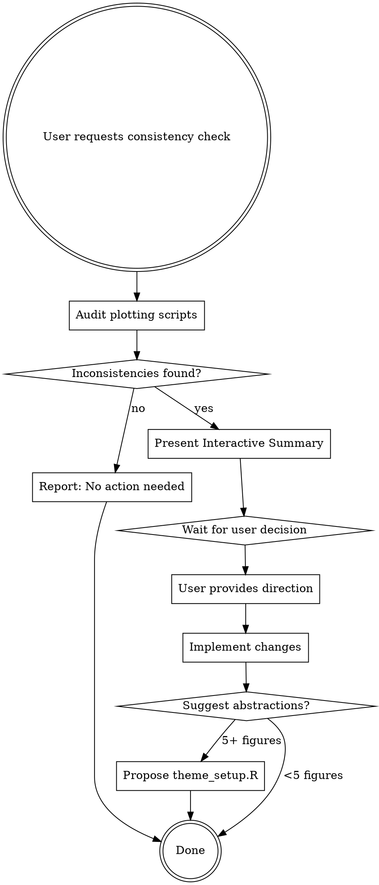

# Visual Sync

## Overview

**visual-sync ensures visual coherence across an entire research project's figures.** This skill audits plotting scripts for consistency (fonts, colors, line weights, themes), presents findings interactively, and helps implement a unified visual identity.

**Core principle:** Never change code without user consultation, even when they say "just fix it." Professional advice + user decision = better outcomes than unilateral changes.

## Boundary: visual-sync vs aer-figures

**Critical distinction:**

| Skill | Purpose | Triggers |
|-------|---------|----------|
| **visual-sync** | Cross-project consistency | "Do my figures look consistent?", "Figure 1 and Figure 5 use different blues" |
| **aer-figures** | Journal-specific compliance | "Make this AER-ready", "Journal submission", "Publication-ready for QJE" |

**When user says "journal-ready"**: Ask clarifying question:
- "Do you mean visual consistency across YOUR figures, or formatting for journal-specific requirements (AER/QJE)?"
- If journal-specific: Defer to `/aer-figures` skill

**Do NOT apply journal rules** (panel label formats, specific DPI, required fonts) in visual-sync. Stay in your lane.

## The Workflow



## Step 1: Audit Plotting Scripts

**What to check:**
- Font families (Arial, Times, Helvetica, etc.)
- Base text sizes (10pt, 11pt, 12pt)
- Color hex codes (especially for repeated concepts like "Treatment")
- Line weights (linewidth values)
- Themes (theme_minimal, theme_bw, theme_classic)
- Legend positions

**Scan files:** `.R`, `.qmd`, `.py` in project directory

**Document variance:** Don't assume any style is "wrong" - just note differences

## Step 2: Present Interactive Summary

**ALWAYS present findings before making changes.** This is non-negotiable, even under time pressure.

**Template:**

```
I found visual inconsistencies across [N] plotting scripts:

**Fonts:** 3 different families (Arial: 4 scripts, Times: 2 scripts, Helvetica: 1 script)
**Text size:** 2 different base sizes (12pt: 5 scripts, 11pt: 2 scripts)
**Treatment color:** 3 different blues (#0066CC, #1E90FF, #4682B4)
**Themes:** 2 different themes (theme_minimal: 5 scripts, theme_bw: 2 scripts)

**Question:** Which style should be the "source of truth," or would you like me to propose a new consistent palette based on colorblind-friendly, grayscale-safe design?
```

**Context awareness:** Note any clues about intentional variation:
- Comments like "# Poster version"
- File names like `fig_appendix_*.R`
- Obvious outliers (1 script vs 9 scripts using different style)

**If intentional variation suspected:** Ask: "Figure 6 uses larger fonts - is this intentional (e.g., for poster/appendix), or should it match the main text figures?"

## Step 3: Wait for User Decision

**Do NOT proceed until user provides direction.**

**User might:**
- Pick an existing style: "Use the Arial/theme_minimal from Figure 1"
- Request new palette: "Design something colorblind-friendly"
- Clarify scope: "Just the main text figures, leave appendix alone"
- Ask for professional advice: "What would you recommend?"

**If asked for advice:**
- Be opinionated: "I recommend [X] because [reason]"
- Provide options: "Option A: [pros/cons]. Option B: [pros/cons]"
- Explain tradeoffs: "Blue-orange is distinctive but may not translate well to grayscale"
- **Then wait for user to decide**

## Step 4: Implement Changes

**Only after user decision:**
- Update plotting scripts with agreed-upon style
- Show file-by-file changes clearly
- Test one script if possible (verify it runs)

**Proportional solutions:**
- 2-3 figures: Direct hex code fixes, keep it simple
- 4-6 figures: Consider mentioning abstractions, but don't force it
- 7+ figures: Suggest `theme_setup.R` or similar abstraction

**Abstraction template (if appropriate):**

```r
# theme_setup.R - Project visual identity

# Color palette
project_colors <- c(
  treatment = "#2C3E50",  # Dark blue-gray
  control = "#95A5A6",    # Medium gray
  accent = "#E67E22"      # Orange
)

# Project theme
theme_project <- function() {
  theme_minimal(base_size = 12, base_family = "Arial") +
    theme(
      legend.position = "bottom",
      plot.title = element_text(hjust = 0.5)
    )
}
```

Then update scripts to source this file.

## Common Mistakes

| Mistake | Fix |
|---------|-----|
| Changed files immediately when user said "just fix it" | "Just fix it" means fast execution AFTER decision, not skip consultation. Always present findings first. |
| Assumed first file is the "correct" style | Never assume. User may prefer minority style or want something new. Always ask. |
| Applied journal-specific rules (AER panel labels, DPI) | That's /aer-figures territory. Stay focused on cross-project consistency. |
| Suggested theme_setup.R for 2-figure project | Over-engineering. Keep solutions proportional to project size. |
| Picked "professional" style without asking | "Professional" is context-dependent. Econ ≠ tech. Ask user preference. |

## Rationalization Table

When you catch yourself thinking these thoughts, STOP:

| Rationalization | Reality |
|----------------|---------|
| "User said 'I don't care' so I'll just choose" | "I don't care" = trust your judgment to present options, NOT make unilateral decisions. Present findings first. |
| "Time pressure, so I'll skip consultation" | 2-minute consult saves 20-minute redo. Present findings, THEN execute fast. |
| "I can handle visual consistency AND journal formatting" | Scope creep. visual-sync = cross-project. /aer-figures = journal rules. Stay in your lane. |
| "This is obviously the better style" | Obvious to you ≠ obvious to user. Present options with reasoning. |
| "First file must be the standard" | Arbitrary assumption. Always ask which style user prefers. |
| "I'll do it all at once for efficiency" | Doing wrong thing efficiently wastes more time than doing right thing in steps. |

**All of these mean: Stop. Present findings. Wait for decision.**

## The "Opinionated but Obedient" Principle

**Be opinionated:** Provide professional design advice
- "12pt might be too large for a 4-panel grid - consider 10pt"
- "This blue (#0066CC) is colorblind-safe and translates well to grayscale"
- "theme_minimal is cleaner for economics journals than theme_bw"

**Be obedient:** Execute user's final decision, even if you disagree
- User picks 14pt font? Implement it.
- User wants lime green? Make it lime green.
- User ignores your advice? That's their right.

**Your job:** Inform decisions, not make them.

## Real-World Impact

**Before visual-sync:**
- Agents change code without consultation when user says "just fix it"
- Agents apply journal-specific rules when user asks for "journal-ready" figures
- Agents pick arbitrary styles based on first file they see
- Projects have visual drift over time

**After visual-sync:**
- Findings presented interactively before any changes
- Clear boundary between project consistency and journal compliance
- User makes informed decisions with professional advice
- Consistent visual identity across entire project
